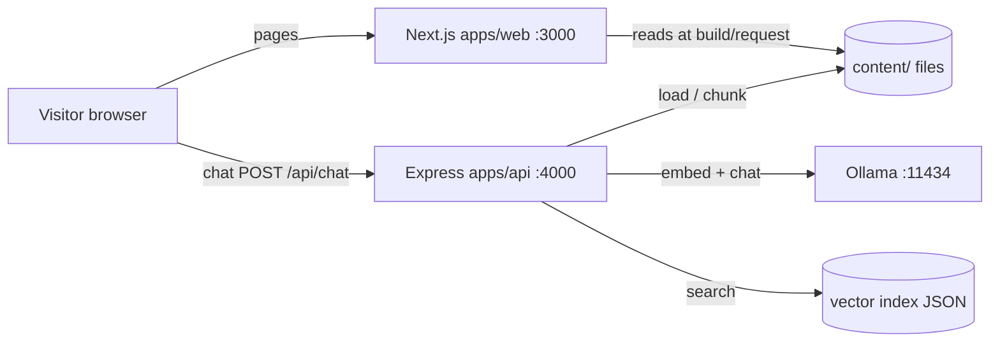

# How this portfolio works

This guide is for you if you have **not** worked much with Next.js, Node backends, or local AI (Ollama). It explains the whole system in plain language, then maps that to folders and files.

Start here when you forget how something fits together. For “how do I deploy later?”, see [`../deploy.md`](../deploy.md).

---

## 1. What you built (one sentence)

A **personal website** (Next.js) whose pages are filled from **markdown/JSON files**, plus a **chat widget** that asks a small **API server** to answer using **your content** and a **local AI** (Ollama) — without inventing details that aren’t documented.

---

## 2. Big picture (request flow)



### Two different “servers”

| Piece | Port | Job |
|-------|------|-----|
| **Web** (`apps/web`) | `3000` | HTML/CSS/JS for the portfolio UI |
| **API** (`apps/api`) | `4000` | Chat + health + reindex; talks to Ollama |
| **Ollama** | `11434` | Runs AI models on your machine |

You only open **http://localhost:3000** in the browser.  
You do **not** need to open `:4000` in a tab — but the API process must be **running**, or chat shows **Failed to fetch**.

---

## 3. Monorepo layout (industry-style)

This repo is an **npm workspaces monorepo**: one git repo, multiple packages that share `node_modules` and can depend on each other.

```
feat-portfolio/                 ← repo root
├── apps/
│   ├── web/                    ← Next.js frontend (@portfolio/web)
│   └── api/                    ← Express backend (@portfolio/api)
├── packages/
│   └── content-core/           ← shared library (@portfolio/content-core)
├── content/                    ← your resume/projects/writing (data, not app code)
├── docs/
│   ├── guide/                  ← human guides (this file)
│   ├── deploy.md               ← hosting notes for later
│   └── superpowers/            ← design/plan history from building the MVP
├── package.json                ← workspaces + root scripts
├── package-lock.json
├── .nvmrc                      ← Node 22
└── README.md                   ← short quick start
```

### Why not one folder with everything?

Production apps usually separate:

1. **UI app** — can deploy to Vercel  
2. **API app** — can deploy to a VPS (needs Ollama / GPU-friendly host)  
3. **Shared library** — one place to parse content so web and API don’t duplicate logic  
4. **Content** — edit copy without hunting through React files  

That split is what you’re looking at.

---

## 4. What each top-level piece does

### `content/` — source of truth

| Path | Purpose |
|------|---------|
| `about.md` | About page + contact lines |
| `skills.json` | Skills + which projects/writing link to them |
| `certifications.json` | Certs on About |
| `projects/*.md` | Project pages (frontmatter + body) |
| `experience/*.md` | Jobs |
| `writing/*.md` | Blog posts |

**Rule of thumb:** change *what you did* here; change *how it looks* in `apps/web`.

Frontmatter example (YAML between `---`):

```md
---
title: Ponteo
slug: ponteo
summary: ...
stack:
  - react-native
  - intercom
---

## Overview
...
```

### `packages/content-core` — shared “reader”

Used by **both** web and API.

| File | Role |
|------|------|
| `src/types.ts` | TypeScript shapes (`Project`, `Skill`, …) |
| `src/load.ts` | Read `content/` → one `PortfolioContent` object |
| `src/chunks.ts` | Split that object into text **chunks** for search/RAG |
| `src/index.ts` | Re-exports the public API |

After changing this package you must rebuild it:

```bash
npm run build -w @portfolio/content-core
```

Web and API import the built package (`dist/`), not the raw TypeScript, in normal runs.

### `apps/web` — Next.js site

Next.js **App Router**: folders under `src/app` become URLs.

| URL | File |
|-----|------|
| `/` | `src/app/page.tsx` |
| `/about` | `src/app/about/page.tsx` |
| `/projects` | `src/app/projects/page.tsx` |
| `/projects/ponteo` | `src/app/projects/[slug]/page.tsx` |
| `/writing/...` | `src/app/writing/...` |

**Conventions inside `apps/web/src`:**

| Folder | Put here |
|--------|----------|
| `app/` | Routes, layouts, global CSS only |
| `components/<domain>/` | UI (`chat`, `layout`, `icons`, `content`, …) |
| `lib/` | Helpers with little/no JSX (`content.ts`, `api.ts`, icon maps) |

Important files:

- `lib/content.ts` — calls `loadPortfolioContent` pointing at repo `content/`
- `lib/api.ts` — browser `fetch` to `NEXT_PUBLIC_API_URL` + `/api/chat`
- `components/chat/ChatWidget.tsx` — floating “ask me” UI
- `app/layout.tsx` — shell (title bar, sidebar, theme) wraps every page

Env: `apps/web/.env.local`

```bash
NEXT_PUBLIC_API_URL=http://localhost:4000
```

`NEXT_PUBLIC_*` means the value is visible in the **browser**. That’s why the chat URL is public; the API still protects itself with CORS + rate limits.

### `apps/api` — Express + RAG

**Conventions inside `apps/api/src`:**

| Folder / file | Role |
|---------------|------|
| `index.ts` | Boot: load config, create clients, `listen`, startup reindex |
| `app.ts` | Build Express app (used by tests without opening a port) |
| `config/` | Env vars → typed config |
| `routes/` | HTTP: parse body, status codes, call services |
| `services/` | Business logic: RAG prompts, reindex orchestration |
| `lib/` | Infrastructure: Ollama HTTP client, vector store |

Endpoints:

| Method | Path | Purpose |
|--------|------|---------|
| `GET` | `/api/health` | API up? Ollama reachable? |
| `POST` | `/api/chat` | Ask a question → reply + sources |
| `POST` | `/api/reindex` | Rebuild search index (needs secret header) |

Runtime data: `apps/api/data/index.json` (embeddings cache; gitignored via `data/`).

Env: `apps/api/.env` (see `.env.example`).

---

## 5. Concepts you need for the chatbot

### Embedding

An **embedding** is a list of numbers that represents the *meaning* of a piece of text.  
Similar meanings → similar numbers (close in “vector space”).

This project uses Ollama model **`nomic-embed-text`** to embed:

- each content **chunk** (at index time)
- each user **question** (at chat time)

### Vector store (simple version)

`lib/vector-store.ts` stores `{ chunk, embedding }[]` in a JSON file and finds the top matches by **cosine similarity**.  
This is a tiny in-process store — fine for a portfolio MVP; production at scale often uses Pinecone, pgvector, etc.

### RAG (Retrieval-Augmented Generation)

Instead of asking the LLM “tell me about Saurabh” from its training data (hallucination risk), we:

1. **Retrieve** the most relevant chunks from *your* content  
2. **Augment** the prompt with those chunks as context  
3. **Generate** an answer that should stick to that context  

### Coverage gate + contact fallback

Related chunks are not always enough. Example: content says “Intercom for support chat” but nothing about **Intercom auth security**.

Flow in `routes/chat.ts` + `services/rag.ts`:

1. Embed question → search index → keep hits above `RELEVANCE_THRESHOLD`  
2. If **no hits** → return fixed **contact** reply (no LLM answer)  
3. If hits exist → ask the model a strict **YES/NO**: does context *specifically* answer this question?  
4. If **NO** (or unclear) → same **contact** reply  
5. If **YES** → second call generates a first-person answer with markdown links  

Contact copy lives in `UNKNOWN_REPLY` in `services/rag.ts` (email, LinkedIn, phone).

### Models used

| Model | Used for |
|-------|----------|
| `nomic-embed-text` | Embeddings |
| `llama3.2` | Chat + coverage gate |

Both run via **Ollama** on your machine (`OLLAMA_URL`, default `http://127.0.0.1:11434`).

---

## 6. Chat path step-by-step (when you click Run)

1. `ChatWidget` calls `sendChatMessage()` in `apps/web/src/lib/api.ts`  
2. Browser `POST http://localhost:4000/api/chat` with `{ message }`  
3. API validates body (Zod), rate-limits  
4. `ollama.embed(message)`  
5. `store.query` → `filterHits`  
6. Coverage gate (`buildCoverageGateMessages` → `contextCoversQuestion`)  
7. Either `UNKNOWN_REPLY` or `ollama.chat(buildChatMessages(...))`  
8. JSON `{ reply, sources }` → widget renders markdown + source badges  

If step 2 fails (API down), the browser throws and the UI shows **Failed to fetch**.

---

## 7. How pages get their data

On the web app, pages call `getContent()` → `loadPortfolioContent("../../content")` from the web package working directory.

So:

- Edit `content/projects/ponteo.md` → refresh the project page (dev server picks it up on next request)  
- For **chat** to see the same change → API must **reindex** (startup does this; or `POST /api/reindex` with `x-reindex-secret`)

Skill chunks are enriched with linked projects (`chunks.ts`), so “Have you used Intercom?” can resolve to Ponteo when `skills.json` lists `projectSlugs: ["ponteo"]`.

---

## 8. Local development checklist

### Prerequisites

1. Node **22** (`nvm use` / `.nvmrc`)  
2. Ollama installed and running  
3. Models pulled:

```bash
ollama pull nomic-embed-text
ollama pull llama3.2
```

### Install & build shared package

```bash
cd /path/to/feat-portfolio
npm install
npm run build -w @portfolio/content-core
```

### Env files

```bash
cp apps/api/.env.example apps/api/.env
cp apps/web/.env.example apps/web/.env.local
```

Use **absolute paths** in API `.env` for `CONTENT_DIR` and `INDEX_PATH` if relative paths confuse you when starting from different directories.

### Run (two terminals)

```bash
# Terminal A — API
npm run start -w @portfolio/api
# or: npm run dev:api   (tsx watch; may need full permissions in some sandboxes)

# Terminal B — Web
npm run dev:web
```

- Site: http://localhost:3000  
- Health: http://localhost:4000/api/health → `{"ok":true,"ollama":true}`

### Useful root scripts

| Script | Meaning |
|--------|---------|
| `npm run dev:web` | Next dev server |
| `npm run dev:api` | API with file watch |
| `npm run start -w @portfolio/api` | Run compiled API (`node dist`) |
| `npm test` | content-core + api tests |
| `npm run build` | Build all three packages |

---

## 9. “I want to change X — where?”

| Goal | Where |
|------|--------|
| Add a project / fix resume facts | `content/projects/…`, `experience/…` |
| Link a skill to a project | `content/skills.json` → `projectSlugs` |
| Change About / contact shown on site | `content/about.md` (+ chat fallback in `rag.ts` if you change contact) |
| Change page layout / VS Code chrome | `apps/web/src/components/layout/`, `app/layout.tsx`, `globals.css` |
| Change chat UI | `apps/web/src/components/chat/` |
| Change chat honesty / fallback text | `apps/api/src/services/rag.ts` |
| Change retrieval threshold | `RELEVANCE_THRESHOLD` in `apps/api/.env` |
| Change models | `EMBED_MODEL` / `CHAT_MODEL` + `ollama pull …` |
| How chunks are built | `packages/content-core/src/chunks.ts` |

After content-core changes: rebuild package, restart API (reindex).  
After only `content/` edits: restart API or call reindex; refresh web.

---

## 10. Testing

```bash
npm test
```

- **content-core**: loading fixtures + chunk expectations  
- **api**: health, chat (mocked Ollama), RAG helpers, vector store  

Web is mostly manual / browser for the MVP.

---

## 11. Hosting (free path)

Production uses **Vercel** for the site and chat (`/api/chat`), with **Gemini** for embeddings + answers. No VPS required.

Full steps: [`../deploy.md`](../deploy.md).

Local Express + Ollama remains optional for development when `NEXT_PUBLIC_API_URL=http://localhost:4000`.

---

## 12. Mental model cheat sheet

- **`content/`** = what you claim about your career  
- **`content-core`** = parse + slice that into structured data / search chunks  
- **`apps/web`** = pretty pages + chat *client*  
- **`apps/api`** = chat *server* + index + Ollama  
- **Ollama** = the actual model weights running locally  
- **Coverage gate** = “don’t BS; send contact instead”  

When something feels “mismanaged,” ask: *is this UI, API, shared library, or content?* Put the change in that layer.
